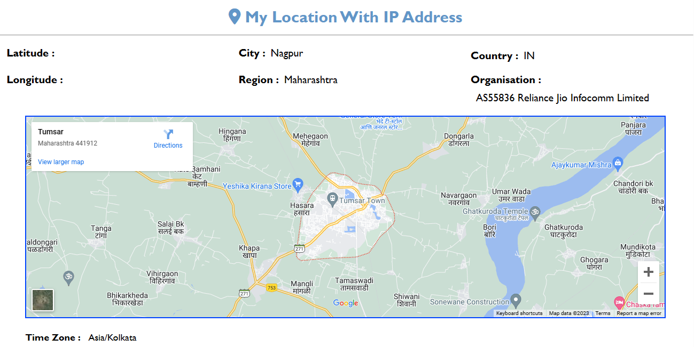
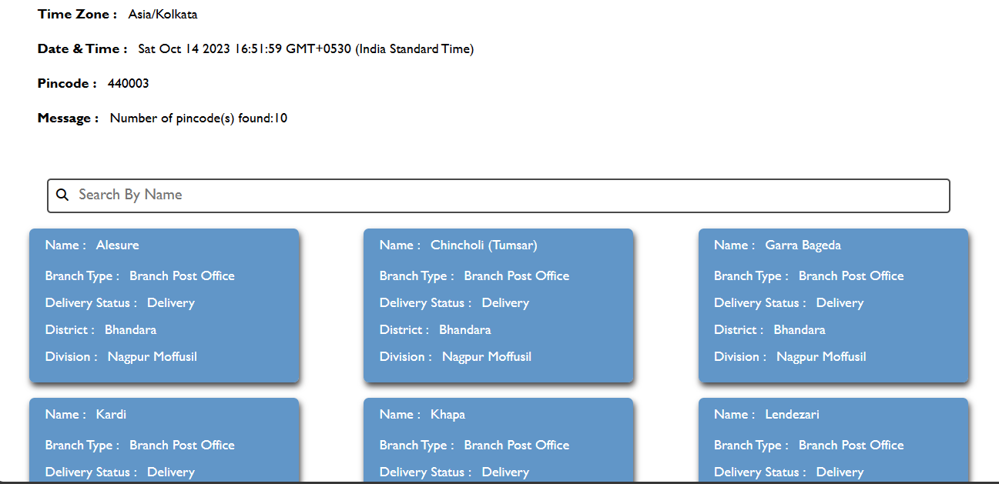

# Search For User Location!
## Introduction:
* This project is designed to fetch user location details, including the IP address, and display them on a webpage. Additionally, it utilizes the user's PIN code to retrieve a list of nearby post offices and display them on the page. The project also includes the ability to filter post offices by name and branch office. The total marks for this project are 100.
  
**Live Demo: https://sakshi-rah.github.io/Sakshi_Rahangdale_DOM_test_14th_Oct_23/**

## Display Information

* JavaScript displays the following information on the page:
  - Latitude
  - Longitude
  - City
  - Region
  - Time Zone

## Show User's Location on Google Maps

* JavaScript uses the latitude and longitude data from the 'ipinfo.io' API to show the user's location on Google Maps.

## Get User's Current Time

* JavaScript retrieves the current time based on the user's Time Zone.

## Fetch Post Offices Using Pin Code

* JavaScript sends a GET request to the 'api.postalpincode.in' API using the Pin Code received from the 'ipinfo.io' API.
* The list of post offices is processed and displayed as per the Figma design.

## Create a Search Box and Filter

* JavaScript creates a search box that allows users to filter post offices by name and branch office.

##  API Integration

* We integrate two APIs: 'ipinfo.io' and 'api.postalpincode.in' for location details and post office information, respectively.

## Project Overview:

